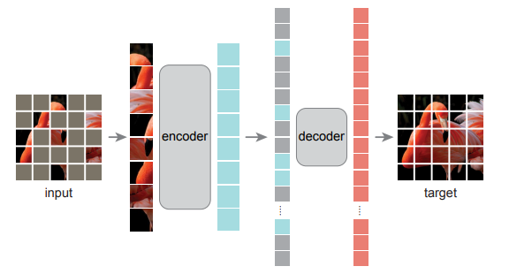

# Masked_AEs
Implementation of Masked-AutoEncoder architecture on Pytorch


<p float="center">
  
</p>

### Requirements
The experiments were performed using Python 3.8.5 with the following Python packages:
- [numpy](http://www.numpy.org/) == 1.18.5
- [torch](https://pytorch.org/) == 1.5.1
- [torchvision](https://pypi.org/project/torchvision/) = 0.6.1


### Usage
To play with my implementation, you can simply put the following command into your terminal after adjusting the necessary parameters:
```
python3 main.py [--data-path DATA_PATH] [--data-set {CIFAR}] 
                [--img_size IMG_SIZE] [--crop_size CROP_SIZE] 
                [--color_jitter COLOR_JITTER] [--train-interpolation TRAIN_INTERPOLATION] 
                [--val_size VAL_SIZE] [--optimizer_name OPTIMIZER_NAME] 
                [--lr LR] [--momentum MOMENTUM] [--batch_size BATCH_SIZE]
                [--num_workers NUM_WORKERS] [--cosine COSINE] [--weight_decay WEIGHT_DECAY] 
                [--patch_size PATCH_SIZE] [--finetune FINETUNE] [--warmup_epochs WARMUP_EPOCHS]
                [--num_epochs NUM_EPOCHS] [--step_display STEP_DISPLAY] [--use-gpu]
```


#### Acknowledgement
Thanks to [FlyEgle](https://github.com/FlyEgle/MAE-pytorch) for his implementation.
